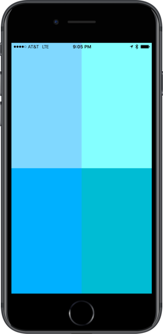
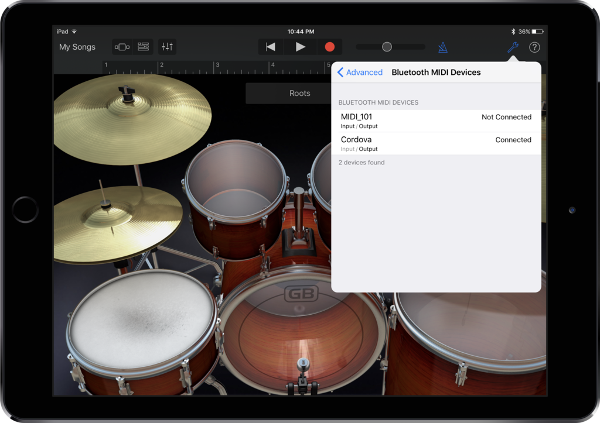

# Cordova Bluetooth MIDI  

This project creates a Bluetooth low energy MIDI controller for Cordova. Hook it to Garage Band and use it as a drum pad.

Open Garage Bands Settings -> Advanced -> Bluetooth MIDI Devices

Uses [cordova-plugin-ble-peripheral](https://github.com/don/cordova-plugin-ble-peripheral)
